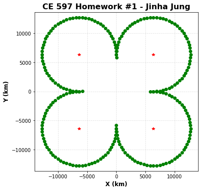

# CE597 - Mapping Projection and Geometric Geodesy

## Homework No. 3 

Submit a jupyter notebook that addresses below questions.

1. Run hw-03.ipynb on your local machine.
1. Create another notebook to plot a clover like below and submit.
  - Include your name in the new notebook file name, i.e., hw-03-jinha.ipynb
  - The new notebook should contain your information, i.e., name, etc.
  - You need to make the notebook readable - add lots of comments in your code and use markdown cell as much as possible to make it readable.
  - Make it sure to submit the new notebook after you run all the cells.
  
**Note:**
- The submitted notebook should be self executable within the current repository.
- All cells in the notebook should be executed before the submission.

