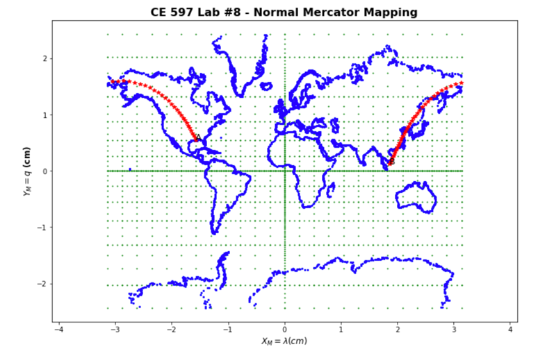

# CE597 – Intro to Geodesy

## Lab 8 - Mapping The Shortest (Geodesic) Distance

You generated 8 maps in Lab 7. In this lab, you will calculate the shortest path between your PoB and your partner's PoB (your partner's PoB should be on a different continent than yours), then plot the geodesic path over 8 maps that you've already created.

1. **(5/5 points)** Print out spherical coordinates of your and your partner's PoB in DMS format with mm accuracy.
1. **(18/20 points)** Generate the shortest path (a series of points on a sphere) between your PoB and your partner's PoB. Hint: Use equations developed from the “Two main problems in Geodesy” lecture to find intermediate points every 250 km until you reached to your partner's PoB. Print a table showing the shortest path with 8 columns as below (S_{M}: geodesic distance to your partner's PoB, Az_{M}: Azimuth between intermediate point and your partner's PoB, Longitude and Latitude of intermediate point, use mm accuracy when reporting longitude and latitude of the intermediate points)

| S_{M} (m) | Az_{M} (deg)| Long (deg) | Long (arcmin) | Long  (arcsec) | Lat (deg) | Lat (arcmin)   | Lat (arcsec) |
| ----------| ------------| -----------| --------------| ---------------| ----------| ---------------|--------------|
| ...       | ...         | ...        | ...           | ...            | ...       | ...            |    ...       |
| ...       | ...         | ...        | ...           | ...            | ...       | ...            |    ...       |

  - **NOTE: You need to report your distance in mm accuracy. Your table matches exactly with mine except that S is reported in meter accuracy. Below is my table for your reference.**
  
  

1. **(18/20 points)** Plot the calculated shortest path on 8 maps with grid lines and coast lines.

  - **NOTE: Your normal Mercator mapping need to include higher latitude to show the full path.**
  
  
  - **NOTE: All other maps looks good.**
  
1. **(20 points)** Discuss the behavior of the shortest path on 8 maps.
  - **NOTE: Great observation and discussion. I really enjoyed reading your story on "doubt and faith" progress while you're working on this lab. :)**
  
## Score: (5+18+18+20)/65 = 9.38
