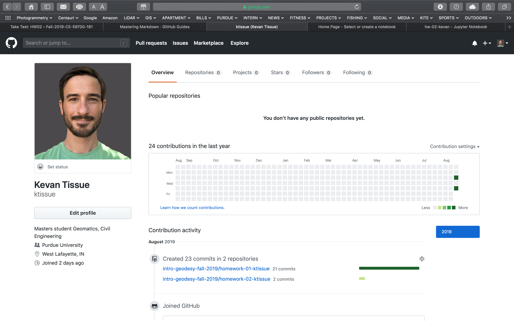
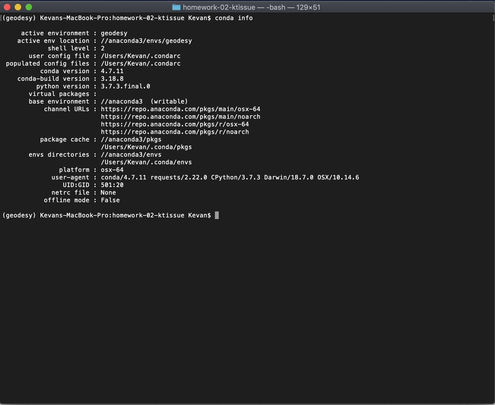

# Homework Assignment No. 2

## Submission list

1. Submit the screenshot of your Github profile page  

1. Submit the screenshot of *$ conda info* command line screen  

1. Save the jupyter notebook as .ipynd file and submit

## Rubric

|                  | 5   | 4   | 3   | 2   | 1   | 0   |
| ---------------- | --- | --- | --- | --- | --- | --- |
| Github profile   |  x   |     |     |     |     |     |
| conda info       |  x   |     |     |     |     |     |
| jupyter notebook |  x   |     |     |     |     |     |

Final grade: 15 / 15 = 10.0
