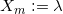
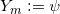

# CE597 - Mapping Projection and Geometric Geodesy

## Lab No. 4 - A nicer mapping: Taking care of convergence of meridian
Submit a jupyter notebook that addresses below questions. The submitted notebook should be self executable within the current repository.

**Note: Assume the Earth is sphere and the radius of the Earth is 6371 km**

1. **(5/5 points)** Select the same original 11 points on the globe as in Lab 1 and Lab 2 - one point in each octant, NP, SP, and your PoB - then print 2 tables.
  - First table should contain spherical coordinates in DMS format (8 columns) with millimeter accuracy.
  - Second table should contain cartesian coordinates in meter format (4 columns) with millimeter accuracy.
  - Each table should contain header.
  - Each table should contain **name** column.
2. **(10/10 points)** With the same program to plot the 11 points, coast line, and grid lines, plot them on a map using a better(?) mapping prescription.
  - A nicer mapping prescription:  and 
  - The mapping prescription should be chosen such that it (in a simple way) takes care of convergence of merician knowing that arlength along a meridian is  but the arclength along parallel circle is not equal to , but equal to .
  - Both coast line and grid line file is given in 3 columns where first column can be ignored, second column = latitude in arcmin, and thrid column = longitude in arcmin format.
3. **(20/20 points)** Select the 15 x 15 degree square of meridian and parallel circle that encloses your PoB, and call this square ABCD. Through measurements and calculation, determine the scale, i.e., the representative fraction of your map for the lines AB, AC, and AD. Show detailed calculations and measurements in the RW and MW.
4. **(20/20 points)** What is your concolusion about the scales of this map? 
  - Is this scale better than the scale of your map in Lab No. 3 - Plate Carree ( and )?
  - What else do (or don't) you like about this map prescription?
  - **NOTE: Good discussion!**
  
## Final score: 10/10
